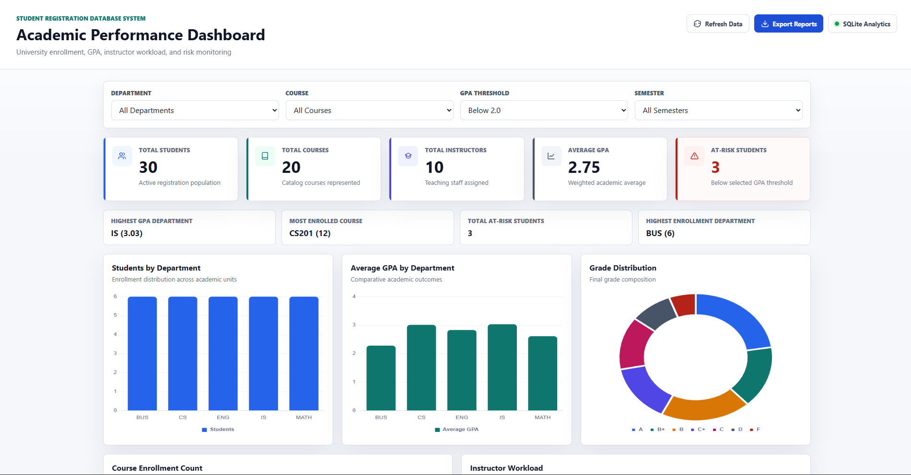
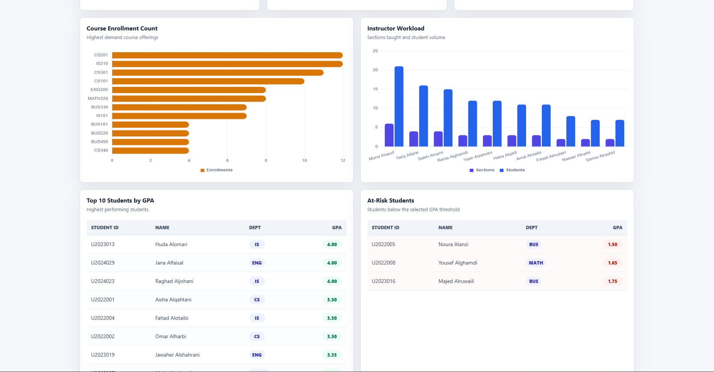
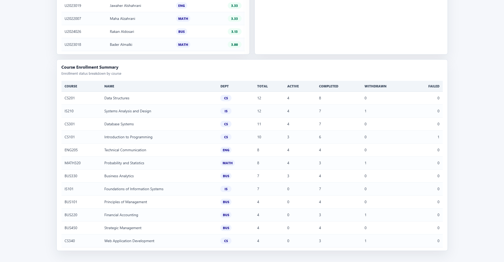

# Student Registration Database System

A GitHub-ready database systems and systems analysis project for a university student registration workflow. The project focuses on relational database design, ERD modeling, normalization, SQL reporting, and academic workflow analysis. A Flask-based Academic Performance Dashboard is included as a supporting interface for visualizing the database outputs.

## Technologies

- SQL
- SQLite
- Database Design
- ERD
- Normalization
- Data Modeling
- System Analysis
- Python
- Flask
- HTML
- CSS
- JavaScript
- Chart.js

## Business Problem

Universities need a reliable way to manage students, departments, instructors, courses, semester-based course offerings, enrollments, and final grades. This project models that academic workflow as a relational database, reduces duplicate data through normalization, protects referential integrity with constraints, and supports administrative reporting through SQL queries.

## Features

- Normalized relational schema for registration and grade management.
- Primary keys, foreign keys, unique constraints, check constraints, and indexes.
- Realistic sample data for departments, students, instructors, courses, offerings, enrollments, and grades.
- Academic workflow modeling for student registration, course offerings, enrollment status, and grade outcomes.
- SQL analysis queries for academic and administrative reporting.
- Python scripts to create the database, run analysis queries, and export CSV reports.
- Flask-based Academic Performance Dashboard as a supporting interface for exploring database reports.
- Complete documentation for business rules, requirements, ERD, normalization, data dictionary, and query explanations.

## Database Architecture and Workflow Modeling

The system is built around a normalized SQLite database for academic registration, grade tracking, and reporting. The design separates master data, academic catalog data, scheduled offerings, transactional enrollments, and grade outcomes into focused tables.

Main database entities:

- `departments`
- `students`
- `instructors`
- `courses`
- `semesters`
- `course_offerings`
- `enrollments`
- `grades`

The database uses one-to-many relationships from departments to students, instructors, and courses. Courses become scheduled classes through course offerings. Students and course offerings have a many-to-many relationship resolved by the enrollments bridge table. Grades are stored separately so each enrollment can have zero or one final grade.

ERD and database documentation:

- [ERD Documentation](docs/erd.md)
- [Normalization Documentation](docs/normalization.md)
- [SQL Query Documentation](docs/sql_queries_explained.md)
- [Data Dictionary](docs/data_dictionary.md)

SQL analysis examples include:

- Student transcript
- Current student enrollments
- Enrollment count by course and department
- Average grade by course
- GPA by student
- Instructor workload
- At-risk students below 2.0 GPA
- Full course schedule
- Department performance summary

## Relevance to Database Systems and Systems Analysis

This project is primarily a database systems and systems analysis project. It models a university registration process by representing students, departments, instructors, courses, semesters, course offerings, enrollments, and grades as related entities. The design captures how students belong to departments, how courses are offered by semester, how instructors teach scheduled sections, and how enrollments connect students to course offerings.

Normalization is used to reduce duplication and improve data integrity. Department details are stored once instead of being repeated across students, instructors, and courses. Course catalog information is separated from semester-specific course offerings, and grades are linked to enrollments rather than duplicated in student or course records.

SQL queries support reporting needs such as student transcripts, GPA calculations, course enrollment counts, instructor workload, department performance, grade distribution, and at-risk student identification. These queries demonstrate how a normalized database can support operational and analytical reporting.

The Flask dashboard supports administrative decision-making by presenting selected SQL outputs through KPI cards, charts, filters, and tables. It is a supporting interface for the database design, not the main identity of the project.

## Academic Performance Dashboard

The project includes a Flask-based Academic Performance Dashboard connected to the SQLite student registration database. The dashboard is included as a supporting visualization layer for database reports and academic decision support.

The dashboard provides insights into:

- Student enrollment
- Academic performance
- GPA monitoring
- Department statistics
- Course demand
- Instructor workload
- Grade distribution
- At-risk student monitoring

Dashboard features:

- Total Students
- Total Courses
- Total Instructors
- Average GPA
- At-Risk Students
- Department Filter
- Course Filter
- GPA Threshold Filter
- Semester Filter
- Students by Department
- Average GPA by Department
- Grade Distribution
- Course Enrollment Count
- Instructor Workload
- Top 10 Students by GPA
- At-Risk Students Table
- Course Enrollment Summary

Dashboard API routes:

- `/`
- `/dashboard`
- `/api/kpis`
- `/api/students-by-department`
- `/api/gpa-by-department`
- `/api/course-enrollment`
- `/api/instructor-workload`
- `/api/grade-distribution`
- `/api/at-risk-students`
- `/api/top-students`
- `/api/student-gpa`

## Screenshots

### Dashboard Overview



### Academic Analytics



### Course Enrollment Summary



Additional screenshots of database tables, query outputs, or exported reports can be stored in the `screenshots/` folder.

## How to Run

1. Install the required Python package.

```bash
pip install -r requirements.txt
```

2. Create the SQLite database.

```bash
python scripts/create_database.py
```

The database is created at:

```text
database/student_registration.db
```

The SQLite database is generated locally and should not be committed to GitHub.

3. Export SQL-based reports.

```bash
python scripts/run_queries.py
python scripts/export_reports.py
```

CSV reports are exported to the `output/` folder:

- `student_transcript_report.csv`
- `course_enrollment_report.csv`
- `department_performance_report.csv`
- `instructor_workload_report.csv`

4. Launch the supporting dashboard interface.

```bash
python app.py
```

Open the dashboard using the Flask URL shown in the terminal.

Example:

```text
http://127.0.0.1:5000/dashboard
```

If Flask starts on a different local port, use the URL shown in your terminal and add `/dashboard`.

## Output Reports

CSV reports are exported to the `output/` folder by:

```bash
python scripts/export_reports.py
```

Included reports:

- `student_transcript_report.csv`
- `course_enrollment_report.csv`
- `department_performance_report.csv`
- `instructor_workload_report.csv`

## Project Structure

```text
student-registration-database-system/
|-- README.md
|-- requirements.txt
|-- app.py
|-- templates/
|   |-- base.html
|   `-- dashboard.html
|-- static/
|   |-- style.css
|   `-- dashboard.js
|-- database/
|   |-- schema.sql
|   |-- sample_data.sql
|   `-- queries.sql
|-- scripts/
|   |-- create_database.py
|   |-- run_queries.py
|   `-- export_reports.py
|-- output/
|   |-- student_transcript_report.csv
|   |-- course_enrollment_report.csv
|   |-- department_performance_report.csv
|   `-- instructor_workload_report.csv
|-- docs/
|   |-- business_rules.md
|   |-- requirements.md
|   |-- normalization.md
|   |-- erd.md
|   |-- data_dictionary.md
|   `-- sql_queries_explained.md
`-- screenshots/
    |-- .gitkeep
    |-- academic-dashboard.png
    |-- academic-dashboard-overview.png
    |-- academic-dashboard-analytics.png
    `-- academic-dashboard-summary.png
```

## Future Improvements

- Add a simple command-line menu for report selection.
- Add prerequisite tracking for courses.
- Add tuition billing and payment records.
- Add audit tables for enrollment changes.
- Add automated tests for constraints and report queries.
- Add filters for semester, department, and enrollment status in the dashboard.

## Author

Sultan Aljobran

GitHub:
[https://github.com/sultanaljobran-spec](https://github.com/sultanaljobran-spec)
